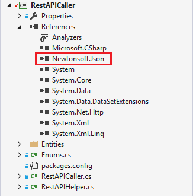
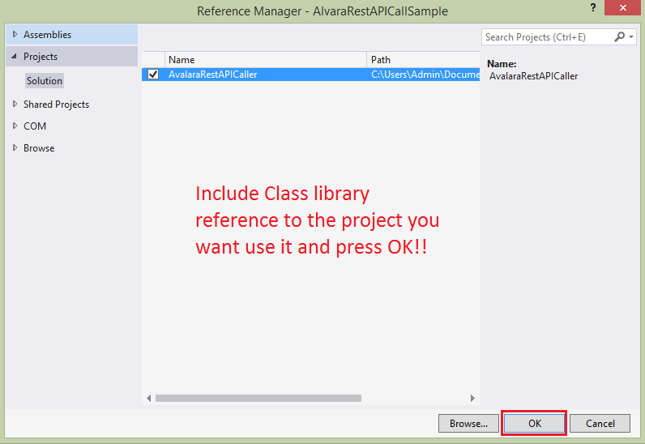

# RestAPI-Helper
A class library to call any Rest API around the web.

#Included Packages
[Json.NET](https://www.nuget.org/packages/newtonsoft.json/)

#How To Use This Library
1. Include this library into your project.
2. Expand References, If you don't find Newtonsoft.Json loaded properly then reinstall it from nuget packet manager.
                          
 

3. Add reference of this class library to your project.
 
4. Pass the request object to the GetResponse method in the RestAPICaller class
5. Set the endpoint,select request method,pass content type, add  all the request headers to the requestHeader dictionary, serialize your    request data and call the MakeRequest method pass all this as parameter.
6. Now in the RestAPICaller class you need to cast the respone from the rest API in your required success and error objects.
7. Outside the class library you will get response status, success response object, error response object.
